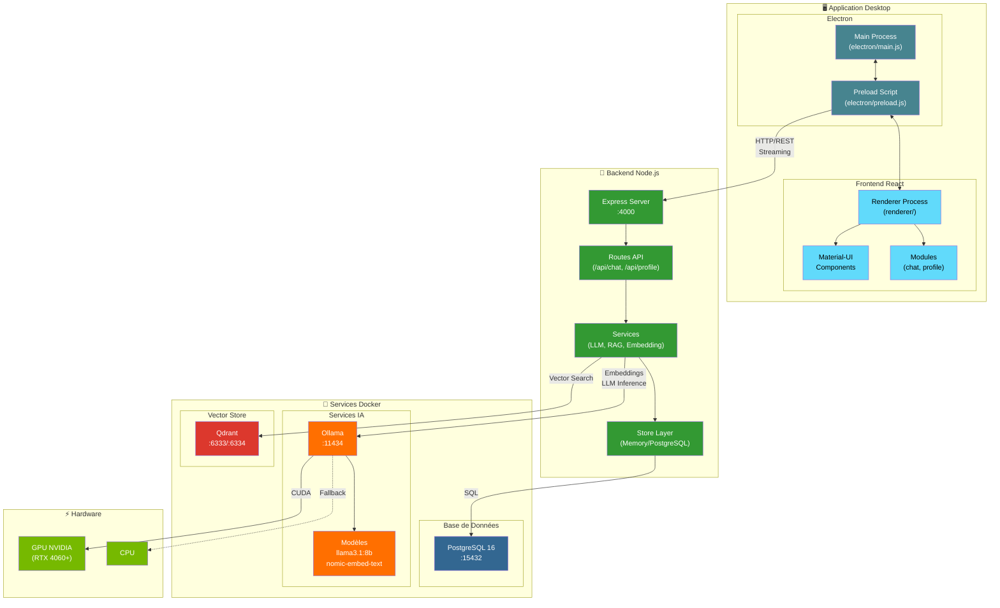
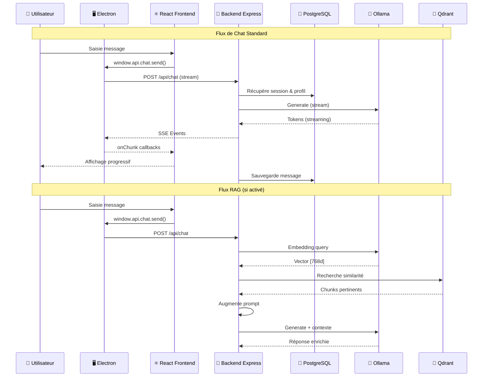
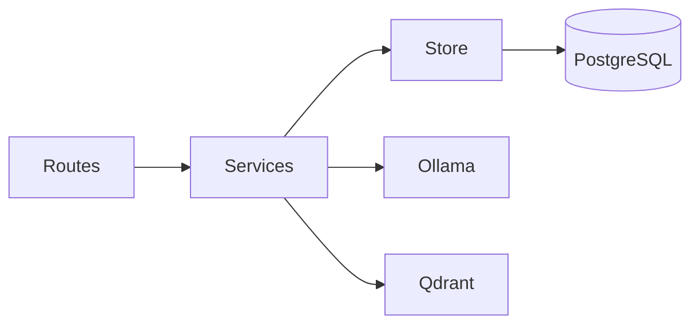
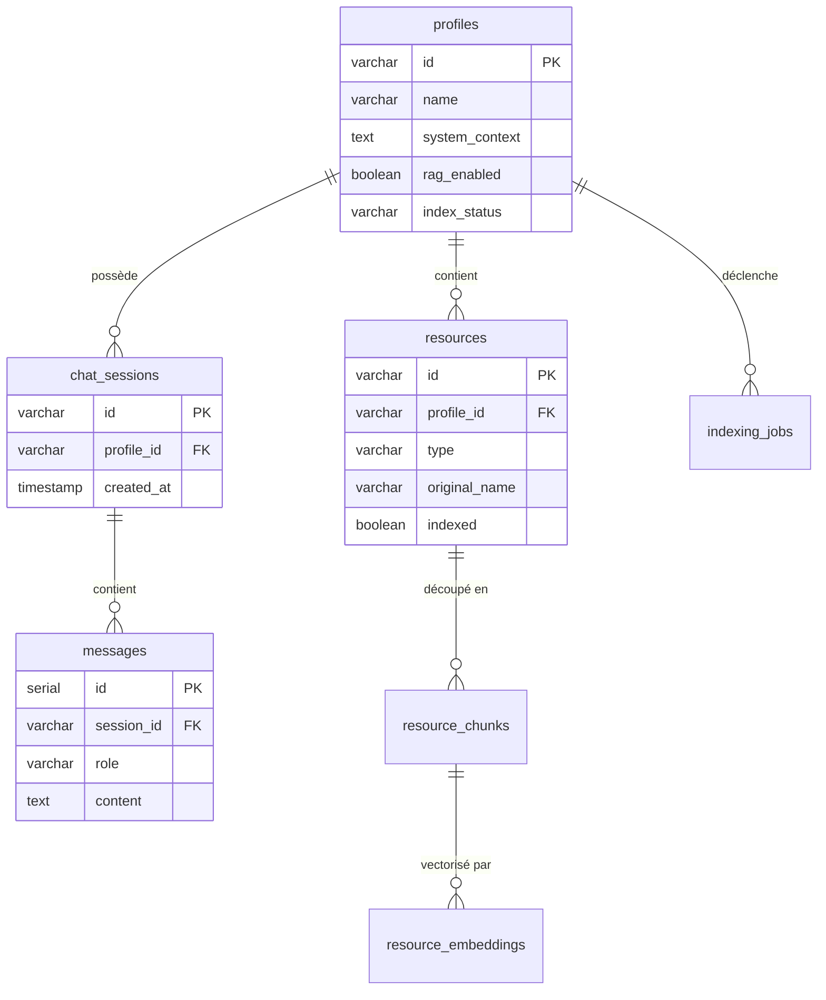
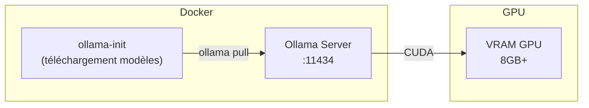
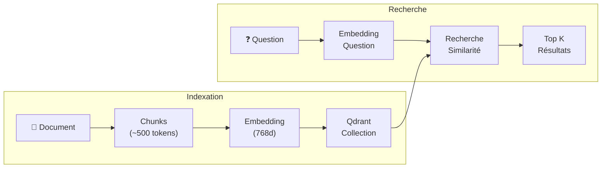
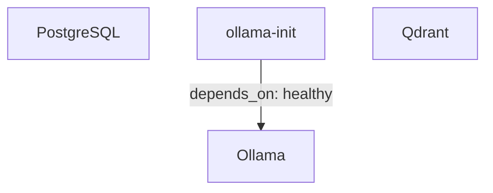

# Architecture Macro - ChatBot Maker

Ce document présente l'architecture globale de l'application ChatBot Maker, une solution desktop permettant de créer et interagir avec des chatbots personnalisés alimentés par un LLM local.

---

## Diagramme d'Architecture Globale



---

## Vue Détaillée des Flux de Données



---

## 1. Electron (Application Desktop)

### Description
Electron encapsule l'application web dans une fenêtre desktop native, permettant un déploiement sur Windows, macOS et Linux sans navigateur externe.

### Composants

| Fichier | Rôle |
|---------|------|
| `electron/main.js` | Processus principal : création de fenêtre, gestion du cycle de vie |
| `electron/preload.js` | Bridge sécurisé entre le renderer et les APIs Node.js via `contextBridge` |

### Configuration de sécurité
```javascript
// Paramètres de sécurité dans main.js
webPreferences: {
    nodeIntegration: false,      // Désactivé pour sécurité
    contextIsolation: true,      // Isolation du contexte
    preload: 'preload.js'        // Script de bridge
}
```

### API exposée au Frontend
Le `preload.js` expose une API sécurisée à `window.api` :

```typescript
window.api = {
    chat: { send, getSession, getSessions, deleteSession },
    profile: { getAll, getById, create, update, delete },
    rag: { uploadResources, getResources, startIndexing, getIndexingStatus }
}
```

---

## 2. Frontend React (Renderer)

### Description
Interface utilisateur moderne construite avec React, TypeScript et Material-UI. Communique avec le backend via les APIs exposées par Electron.

### Structure des modules

```
renderer/src/
├── modules/
│   ├── chat/           # Page de chat, liste messages, input
│   └── profile/        # Gestion des profils de chatbot
├── services/           # Appels API (chat, profile, rag)
├── components/         # Composants réutilisables
├── contexts/           # Contextes React (thème, auth)
└── theme/              # Configuration Material-UI
```

### Technologies

| Technologie | Version | Usage |
|-------------|---------|-------|
| React | 18.x | Framework UI |
| TypeScript | 5.x | Typage statique |
| Vite | 5.x | Bundler & dev server |
| Material-UI | 5.x | Composants UI |
| React Router | 6.x | Navigation |

### Variables d'environnement Frontend

| Variable | Défaut | Description |
|----------|--------|-------------|
| `VITE_API_URL` | http://localhost:4000 | URL du backend (dev) |

---

## 3. Backend Express (API Server)

### Description
Serveur API REST en Node.js/TypeScript qui orchestre toutes les opérations : gestion des profils, sessions de chat, appels LLM et RAG.

### Architecture en couches



| Couche | Dossier | Responsabilité |
|--------|---------|----------------|
| **Routes** | `src/routes/` | Points d'entrée HTTP, validation |
| **Services** | `src/services/` | Logique métier, orchestration |
| **Store** | `src/store/` | Abstraction persistance (memory/postgres) |
| **Models** | `src/models/` | Définitions TypeScript des entités |

### Routes principales

| Endpoint | Méthode | Description |
|----------|---------|-------------|
| `/api/chat` | POST | Envoi de message (streaming) |
| `/api/chat/sessions` | GET | Liste des sessions |
| `/api/profile` | CRUD | Gestion des profils |
| `/api/profile/:id/resources` | POST | Upload fichiers RAG |
| `/api/profile/:id/index` | POST | Lancement indexation |
| `/api/indexing-jobs/:id` | GET | Statut d'indexation |
| `/health` | GET | Health check |

### Variables d'environnement Backend

Fichier : `backend/.env`

| Variable | Défaut | Description |
|----------|--------|-------------|
| `PORT` | 4000 | Port du serveur Express |
| `STORE_MODE` | postgres | Mode de stockage : `memory` ou `postgres` |
| `DB_HOST` | localhost | Hôte PostgreSQL |
| `DB_PORT` | 15432 | Port PostgreSQL |
| `DB_NAME` | electron_chat | Nom de la base de données |
| `DB_USER` | electron_user | Utilisateur PostgreSQL |
| `DB_PASSWORD` | electron_password | Mot de passe PostgreSQL |
| `OLLAMA_ENABLED` | true | Activer/désactiver Ollama |
| `OLLAMA_URL` | http://localhost:11434 | URL du service Ollama |
| `OLLAMA_DEFAULT_MODEL` | llama3.1:8b | Modèle LLM par défaut |
| `OLLAMA_TIMEOUT_MS` | 120000 | Timeout des requêtes (ms) |
| `OLLAMA_WARMUP` | true | Précharger le modèle au démarrage |
| `LLM_MAX_HISTORY` | 16 | Messages historiques envoyés au LLM |
| `EMBEDDING_PROVIDER` | ollama | Provider d'embeddings |
| `EMBEDDING_MODEL` | nomic-embed-text | Modèle d'embeddings |

---

## 4. PostgreSQL (Base de Données)

### Description
Base de données relationnelle stockant les profils, sessions de chat, messages et métadonnées des ressources RAG.

### Schéma simplifié



> 📄 Documentation complète : [`docs/DATABASE_MPD.md`](DATABASE_MPD.md)

### Configuration Docker

| Variable | Défaut | Description |
|----------|--------|-------------|
| `POSTGRES_DB` | electron_chat | Nom de la base |
| `POSTGRES_USER` | electron_user | Utilisateur |
| `POSTGRES_PASSWORD` | electron_password | Mot de passe |
| `POSTGRES_PORT` | 15432 | Port exposé |

### Connexion

```bash
# Depuis le host
psql -h localhost -p 15432 -U electron_user -d electron_chat

# Depuis Docker
docker exec -it electron-chat-postgres psql -U electron_user -d electron_chat
```

---

## 5. Ollama (LLM Local)

### Description
Serveur d'inférence LLM local permettant d'exécuter des modèles de langage sur GPU NVIDIA ou CPU. Gère à la fois la génération de texte et les embeddings.

### Modèles utilisés

| Modèle | Taille | Usage | Dimensions |
|--------|--------|-------|------------|
| `llama3.1:8b` | ~4.7GB | Génération de réponses | - |
| `nomic-embed-text` | ~274MB | Embeddings RAG | 768 |

### Architecture de déploiement



### Configuration Docker

| Variable | Défaut | Description |
|----------|--------|-------------|
| `OLLAMA_PORT` | 11434 | Port HTTP API |
| `OLLAMA_NUM_PARALLEL` | 1 | Requêtes simultanées |
| `OLLAMA_MAX_LOADED_MODELS` | 1 | Modèles en VRAM |
| `OLLAMA_DEFAULT_MODEL` | llama3.1:8b | Modèle par défaut |

### API Ollama utilisée

| Endpoint | Usage |
|----------|-------|
| `POST /api/generate` | Génération de texte (streaming) |
| `POST /api/embeddings` | Génération d'embeddings |
| `GET /api/tags` | Liste des modèles |
| `GET /api/ps` | Modèles chargés en mémoire |

### Support GPU

```yaml
# docker-compose.yml
deploy:
  resources:
    reservations:
      devices:
        - driver: nvidia
          count: all
          capabilities: [gpu]
```

**Prérequis GPU :**
- Driver NVIDIA 525+
- Docker Desktop avec GPU support
- GPU avec 8GB+ VRAM recommandé

### Commandes utiles

```bash
# Vérifier les modèles installés
docker exec electron-chat-ollama ollama list

# Tester le LLM
curl http://localhost:11434/api/generate -d '{"model":"llama3.1:8b","prompt":"Hello"}'

# Voir les modèles chargés
curl http://localhost:11434/api/ps
```

---

## 6. Qdrant (Vector Store)

### Description
Base de données vectorielle haute performance pour le stockage et la recherche des embeddings RAG. Permet la recherche par similarité sémantique.

### Architecture RAG



### Configuration Docker

| Variable | Défaut | Description |
|----------|--------|-------------|
| `QDRANT_PORT` | 6333 | Port HTTP REST |
| `QDRANT_GRPC_PORT` | 6334 | Port gRPC |

### Structure des collections

Chaque profil avec RAG activé a sa propre collection :

```
Collection: profile_{profileId}_{embeddingModel}
├── Vectors: float[768]
├── Payload:
│   ├── chunk_id
│   ├── resource_id
│   ├── resource_name
│   ├── content
│   └── metadata
```

### Paramètres de recherche

| Paramètre | Défaut | Description |
|-----------|--------|-------------|
| `topK` | 5 | Nombre de résultats retournés |
| `similarityThreshold` | 0.7 | Seuil de similarité minimum |

### API REST

```bash
# Lister les collections
curl http://localhost:6333/collections

# Info sur une collection
curl http://localhost:6333/collections/{collection_name}

# Dashboard web
open http://localhost:6333/dashboard
```

---

## 7. Docker Compose (Orchestration)

### Description
Orchestre tous les services conteneurisés avec leurs dépendances et volumes persistants.

### Services

```yaml
services:
  postgres:      # Base de données
  ollama:        # LLM Server (GPU)
  ollama-init:   # Téléchargement modèles
  qdrant:        # Vector Store
```

### Volumes persistants

| Volume | Contenu |
|--------|---------|
| `postgres_data` | Données PostgreSQL |
| `ollama_data` | Modèles LLM téléchargés |
| `qdrant_data` | Collections vectorielles |

### Dépendances



### Commandes

```bash
# Démarrer tous les services
docker-compose up -d

# Voir les logs
docker-compose logs -f

# Arrêter
docker-compose down

# Reset complet (supprime les données)
docker-compose down -v
```

---

## 8. Flux de Données Complet

### Chat Simple (sans RAG)

```
1. Utilisateur tape message
2. Frontend → Preload → Backend (POST /api/chat)
3. Backend récupère profil + historique (PostgreSQL)
4. Backend construit prompt avec system_context
5. Backend appelle Ollama (streaming)
6. Ollama génère tokens → Backend → SSE → Frontend
7. Frontend affiche progressivement
8. Backend sauvegarde message (PostgreSQL)
```

### Chat avec RAG

```
1. Utilisateur tape message
2. Backend génère embedding de la question (Ollama)
3. Backend recherche chunks similaires (Qdrant)
4. Backend augmente le prompt avec le contexte trouvé
5. Backend appelle Ollama avec prompt enrichi
6. Réponse basée sur les documents indexés
```

### Indexation RAG

```
1. Utilisateur upload fichiers
2. Backend stocke fichiers + métadonnées (PostgreSQL)
3. Utilisateur lance indexation
4. Backend découpe en chunks (~500 tokens)
5. Backend génère embeddings (Ollama)
6. Backend stocke vecteurs (Qdrant)
7. Backend met à jour index_status = 'ready'
```

---

## 9. Résumé des Ports

| Service | Port | Protocol | Usage |
|---------|------|----------|-------|
| Backend Express | 4000 | HTTP | API REST + SSE |
| Frontend Vite | 5173 | HTTP | Dev server |
| PostgreSQL | 15432 | TCP | SQL |
| Ollama | 11434 | HTTP | LLM API |
| Qdrant HTTP | 6333 | HTTP | Vector REST |
| Qdrant gRPC | 6334 | gRPC | Vector gRPC |

---

## 10. Fichiers de Configuration

| Fichier | Description |
|---------|-------------|
| `.env` (racine) | Variables Docker Compose |
| `backend/.env` | Configuration backend |
| `docker-compose.yml` | Orchestration Docker |
| `backend/database/init.sql` | Schéma SQL initial |
| `renderer/vite.config.js` | Configuration Vite |
| `electron/main.js` | Configuration Electron |

